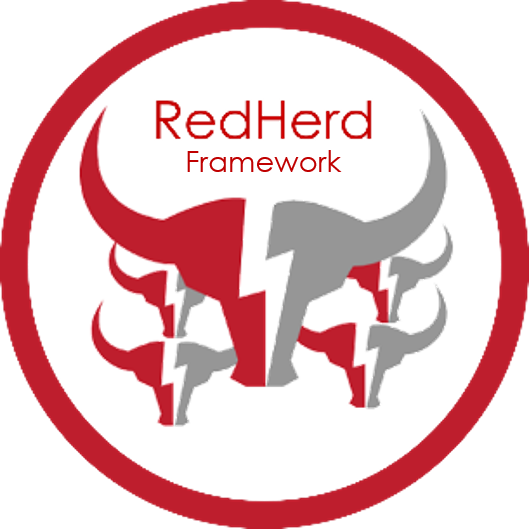

# What is RedHerd?

RedHerd is a collaborative and serverless framework for orchestrating a geographically distributed group of assets capable of <del>conducting</del> simulating complex Offensive Cyberspace Operations (OCOs). 

The framework takes advantage of the "as a Service" paradigm in order to deploy a ready-to-use infrastructure that can also be adopted for effective training purposes, by reliably reproducing a real-world cyberspace scenario in which red and blue teams can challenge each other. RedHerd perfectly fits the Open Systems Architecture design pattern, thanks to the adoption of both open standards and wide-spread open source software components.

# Disclaimer

The provided contents and tools are for awareness and research purposes only. Our target audience is composed of those interested in learning about Ethical Hacking, Security, Penetration Testing and Red Teaming. We are not responsible for any inappropriate or illegal usage of both proposed material and discussed topics.
